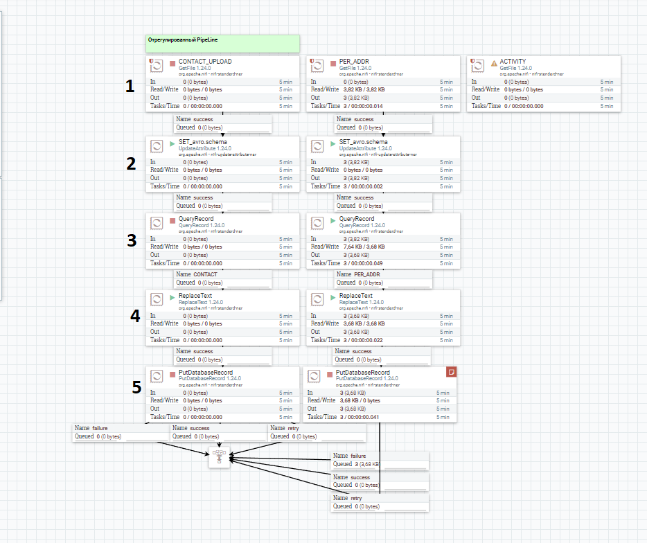
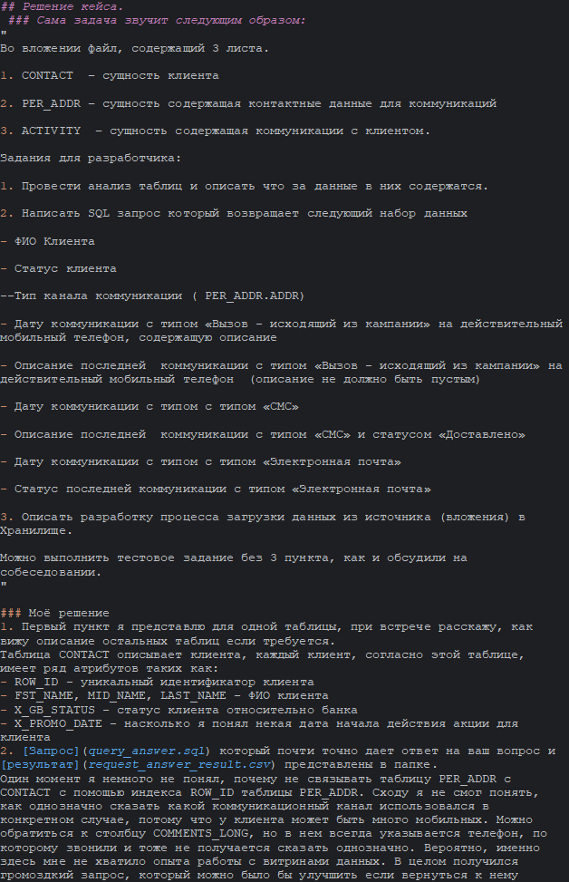

 ## Решение кейса.
 ### Сама задача звучит следующим образом: 
"  
Во вложении файл, содержащий 3 листа.

1. CONTACT  – сущность клиента

2. PER_ADDR – сущность содержащая контактные данные для коммуникаций

3. ACTIVITY  – сущность содержащая коммуникации с клиентом.

Задания для разработчика:

1. Провести анализ таблиц и описать что за данные в них содержатся.

2. Написать SQL запрос который возвращает следующий набор данных

- ФИО Клиента

- Статус клиента

--Тип канала коммуникации ( PER_ADDR.ADDR)

- Дату коммуникации с типом «Вызов - исходящий из кампании» на действительный мобильный телефон, содержащую описание

- Описание последней  коммуникации с типом «Вызов - исходящий из кампании» на действительный мобильный телефон  (описание не должно быть пустым)

- Дату коммуникации с типом с типом «СМС»

- Описание последней  коммуникации с типом «СМС» и статусом «Доставлено»

- Дату коммуникации с типом с типом «Электронная почта»

- Статус последней коммуникации с типом «Электронная почта»

3. Описать разработку процесса загрузки данных из источника (вложения) в Хранилище.

Можно выполнить тестовое задание без 3 пункта, как и обсудили на собеседовании.  
"  

### Моё решение
1. Первый пункт я представлю для одной таблицы, при встрече расскажу как вижу описание остальных таблиц если требуется.  
Таблица CONTACT описывает клиента, каждый клиент, согласно этой таблице, имеет ряд атрибутов таких как:  
- ROW_ID - уникальный идентификатор клиента
- FST_NAME, MID_NAME, LAST_NAME - ФИО клиента
- X_GB_STATUS - статус клиента относительно банка
- X_PROMO_DATE - насколько я понял некая дата начала действия акции для клиента
2. [Запрос](query_answer.sql) который почти точно дает ответ на ваш вопрос и [результат](request_answer_result.csv) представлены в папке.  
Один момент я немного не понял, почему не связывать таблицу PER_ADDR с CONTACT с помощью индекса ROW_ID таблицы PER_ADDR. Сходу я не смог понять как однозначно сказать какой коммуникационный канал использовался в конкретном случае, потому что у клиента может быть много мобильных. Можно обратиться к столбцу COMMENTS_LONG, но в нем всегда указывается телефон по которому звонили и тоже не получается сказать однозначно. Вероятно имеенно здесь мне не хватило опыта работы с витринами данных. В целом получился громоздкий запрос который можно было бы улучшить если вернуться к нему снова, но хотелось приступить в третьему пункту. 
3. Сначала выполнил данный пункт "на один раз" при помощи excel собрал вставки для всей таблицы и получился [скрипт для создания нашей мини-дб](Create%20schema%20and%20content.sql).  
Так же есть [скрипт для создания пустой дб](Create%20schema%20sinara%20only.sql).  
[Файл](%D2%E5%F1%F2%EE%E2%EE%E5%20Data.xls) в котором протягивал формулы excel для формирования вставок.  
  Собрал пример потока для данных который извлекает записи из CSV и вставляет в БД в Apache NIFI. Вот [поток](sinara.xml) который могу продемонстрировать на встрече и рассказать как работает более подробно.  
  
  
Краткое описание здесь:
1) Выгрузка источника данных
2) Добавление атрибутов: атрибут с авросхемой, атрибут с названием таблицы в которую будем вставлять данные.  
3) Небольшой SQL запрос чтобы удальть ненужные колонки.  
4) Замена заголовка CSV с высокого регистра на низкий регистр.  
5) Вставка данных в базу данных